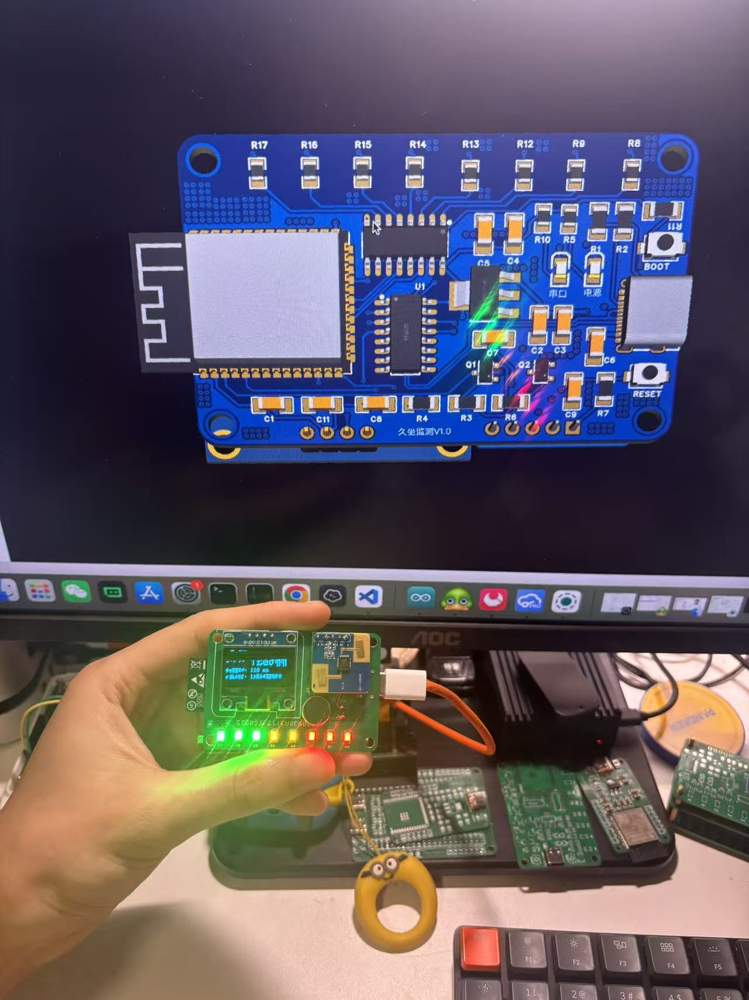
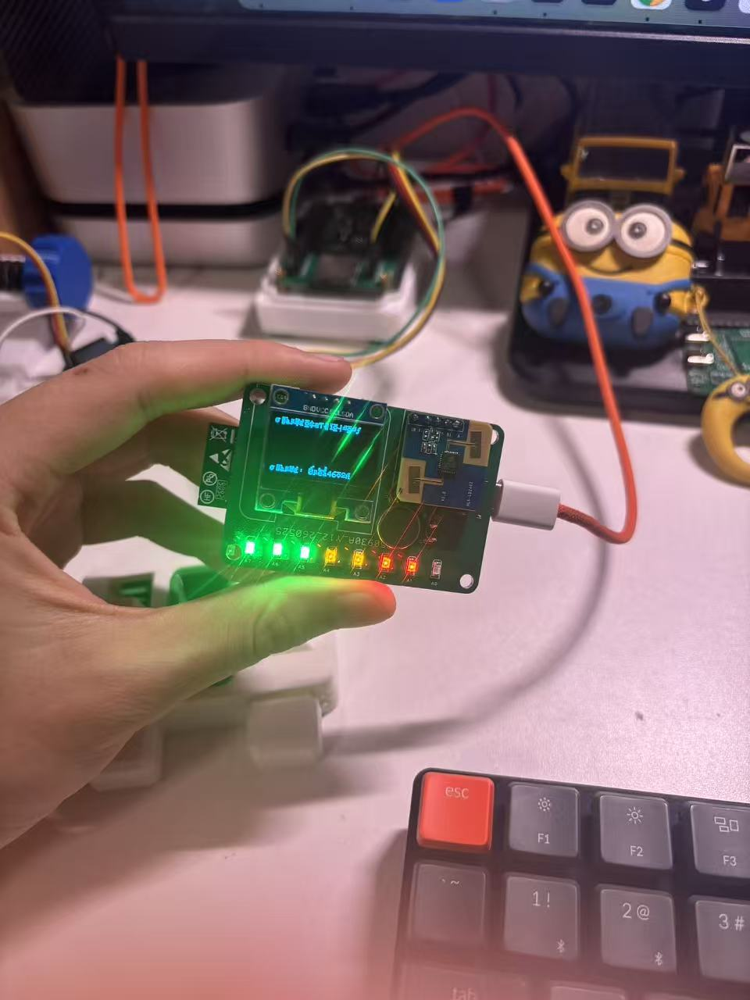
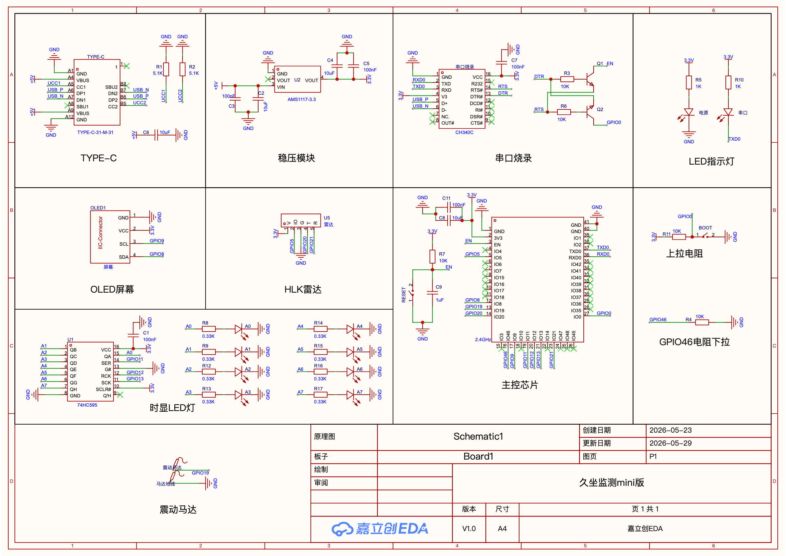
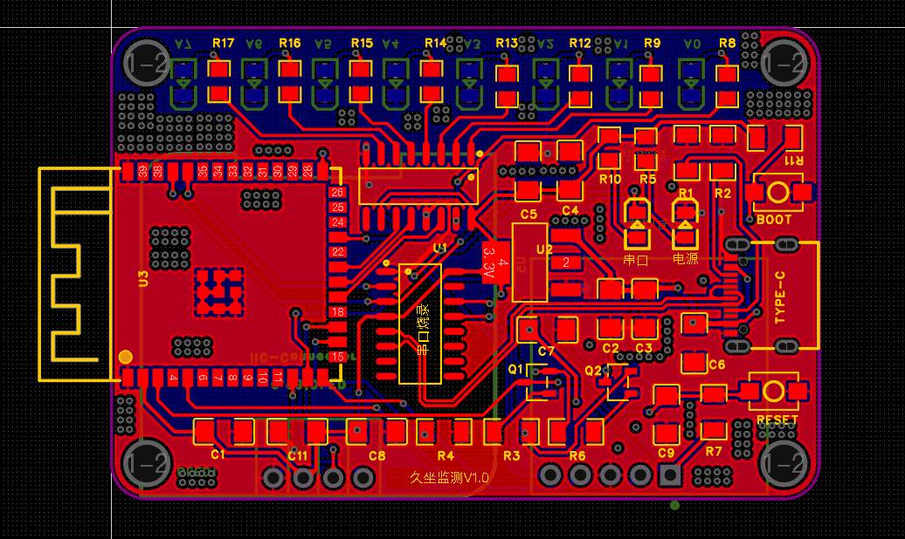

# 智能久坐监测系统

一套软硬件结合的久坐健康管理方案。通过毫米波雷达实时检测人体存在，结合后端数据分析与多重提醒机制，帮助用户养成良好的坐姿习惯。

## 演示视频

🎬 **B 站演示视频：** [智能久坐监测系统演示](https://www.bilibili.com/video/BV1NXV36CEWU/)

## 硬件设计

### PCB 实物图




### 原理图





### BOM 物料清单

📄 [BOM_Board1_PCB1_2026-05-31.xlsx](Image/BOM_Board1_PCB1_2026-05-31.xlsx)

### 硬件组成

| 模块 | 型号 | 说明 |
|------|------|------|
| 主控芯片 | ESP32-C3 | WiFi + BLE，负责数据采集和通信 |
| 雷达传感器 | HLK-LD2402 | 毫米波人体存在检测，UART 通信 |
| 显示屏 | SSD1306 | 128×64 OLED，I2C 接口 |
| LED 灯组 | 8 颗 LED | 74HC595 移位寄存器驱动 |
| 震动马达 | — | GPIO 控制，触觉反馈 |
| 指示灯 | — | 人体存在状态指示 |

## 功能特性

### 1. 人体存在检测
- LD2402 毫米波雷达实时检测人体存在
- 测量人体与设备的距离（20cm ~ 200cm）
- 滑动窗口算法过滤误判

### 2. 久坐数据统计
- 每 60 秒上报状态数据（有人/无人 + 距离）
- 原始分钟数据完整保留，支持回溯分析
- 多维度统计：小时 / 日 / 周 / 月

### 3. 多重提醒机制
- **语音提醒**：TTS 文字转语音，通过 MQTT 发送到设备播放
- **手机推送**：Bark 推送通知到 iOS 设备
- **设备震动**：震动马达，可配置时长和间隔
- **灯光警示**：8 颗 LED 通过不同模式提示久坐状态

### 4. 六种 LED 灯光模式

| 模式 | 说明 |
|------|------|
| 渐进 | 随久坐时间递增亮灯，8 级渐进提示 |
| 全闪 | 8 灯同时闪烁，醒目提醒 |
| 追逐 | 单灯依次跑动，吸引注意力 |
| 全亮 | 8 灯全部常亮，最大亮度警告 |
| 全灭 | 8 灯全部关闭，静默模式 |
| 呼吸 | 灯光由少到多再到少，模拟呼吸节奏 |

亮度支持 3 级调节（低/中/高），所有模式可通过 API 远程切换。

### 5. OLED 实时显示
- 大字体显示当前检测距离（厘米）
- 久坐计时（分:秒）
- 距离进度条
- WiFi 连接状态
- 震动动画图标

### 6. 语音交互
- 语音识别（faster-whisper）
- AI 对话（豆包大模型）
- 语音合成（Edge-TTS）

## 系统架构

```
┌──────────────┐     HTTP POST (每60秒)     ┌────────────────┐
│              │ ──────────────────────────→ │                │
│   ESP32 设备  │     MQTT 订阅 (控制指令)    │  Flask 后端服务  │
│  LD2402 雷达  │ ←────────────────────────── │  PostgreSQL    │
│  OLED + 8灯   │                             │  MQTT Broker   │
│  震动马达     │                             │  Bark 推送     │
└──────────────┘                             └────────────────┘
                                                      │
                                                      ▼
                                              ┌────────────────┐
                                              │  手机/Web 前端  │
                                              │  统计图表展示   │
                                              │  设备远程配置   │
                                              └────────────────┘
```

## 项目结构

```
SedentaryMonitoring/
├── app.py                         # 主应用入口
├── config.py                      # 配置文件
├── Common/
│   └── Response.py                # 统一响应格式
├── database/
│   ├── Postgresql.py              # PostgreSQL 连接
│   └── operateFunction.py         # 数据库操作
├── functions/
│   ├── user.py                    # 用户功能
│   ├── speech_to_text.py          # 语音转文字（Whisper）
│   ├── text_to_speech.py          # 文字转语音（Edge-TTS + MQTT）
│   ├── doubao.py                  # 豆包 AI 对话
│   ├── device_time_static.py      # 设备事件处理
│   ├── sedentary_daily_stats.py   # 久坐统计（分钟/小时/日/周/月）
│   ├── sedentary_reminder.py      # 久坐提醒（语音+Bark+设备控制）
│   ├── device_control.py          # 设备控制（LED+震动，MQTT下发）
│   ├── notification_settings.py   # 通知开关设置
│   ├── bark_settings.py           # Bark 推送设置
│   └── bark_notice.py             # Bark 推送发送
├── migrations/
│   ├── user_table.py              # 用户表
│   ├── user_text_stastic.py       # 文本统计表
│   ├── device_time_static.py      # 设备事件表
│   ├── sedentary_minute_records.py # 分钟记录表
│   ├── sedentary_reminder.py      # 提醒设置 + 记录表
│   ├── notification_settings.py   # 通知设置表
│   ├── bark_settings.py           # Bark 设置表
│   └── device_control_settings.py # 设备控制设置表
├── Image/                         # 硬件图片、原理图、BOM
└── audio/                         # TTS 音频文件存储
```

## 环境要求

- Python 3.9+
- PostgreSQL 12+
- MQTT Broker（EMQX / Mosquitto）
- ffmpeg（音频处理）

## 安装依赖

```bash
pip install flask flask-cors flask-socketio psycopg2-binary faster-whisper numpy edge-tts paho-mqtt requests
```

**安装 ffmpeg：**
- macOS: `brew install ffmpeg`
- Ubuntu: `sudo apt-get install ffmpeg`

## 配置说明

编辑 `config.py` 文件：

```python
# 数据库
DATABASES = {
    'default': {
        'NAME': 'postgres',
        'USER': 'postgres',
        'PASSWORD': '密码',
        'HOST': '主机地址',
        'PORT': '5432',
    }
}

# MQTT
MQTT_BROKER = "Broker地址"
MQTT_PORT = 1883
MQTT_USER = "用户名"
MQTT_PASS = "密码"

# Bark 推送
BARK_DEVICE_KEY = "你的Bark设备密钥"

# 豆包 AI
DOUBAO_API_KEY = "你的API Key"
DOUBAO_MODEL = "模型名称"
```

## 初始化数据库

```bash
python migrations/user_table.py
python migrations/user_text_stastic.py
python migrations/device_time_static.py
python migrations/sedentary_minute_records.py
python migrations/sedentary_reminder.py
python migrations/notification_settings.py
python migrations/bark_settings.py
python migrations/device_control_settings.py
```

## 运行项目

```bash
python app.py
```

## API 接口

### 数据上报

| 接口 | 方法 | 说明 |
|------|------|------|
| `/api/sedentary_report` | POST | 设备每分钟上报状态数据 |
| `/api/static_time` | POST | 设备事件上报（旧接口） |

### 统计查询

| 接口 | 方法 | 说明 |
|------|------|------|
| `/api/sedentary_hourly/<device_id>` | GET | 小时统计（24小时分布） |
| `/api/sedentary_daily/<device_id>` | GET | 日统计 |
| `/api/sedentary_weekly/<device_id>` | GET | 周统计 |
| `/api/sedentary_monthly/<device_id>` | GET | 月统计 |

### 提醒设置

| 接口 | 方法 | 说明 |
|------|------|------|
| `/api/sedentary_settings/<device_id>` | GET/POST | 久坐提醒设置 |
| `/api/notification_settings/<device_id>` | GET/POST | 通知开关设置 |
| `/api/bark_settings/<device_id>` | GET/POST | Bark 推送设置 |

### 设备控制

| 接口 | 方法 | 说明 |
|------|------|------|
| `/api/device_control/<device_id>` | GET/POST | 设备控制设置（LED+震动） |
| `/api/device_control/modes` | GET | 获取可用 LED 模式列表 |
| `/api/device_control/test/<device_id>` | POST | 测试下发控制命令 |
| `/api/device_control/direct/<device_id>` | POST | 直接下发控制命令 |

### 语音交互

| 接口 | 方法 | 说明 |
|------|------|------|
| `/api/transcribe` | POST | 语音转文字 |
| `/api/transcribe_tts` | POST | 语音转文字 + 播放 |
| `/api/transcribe_dou` | POST | 语音转文字 + 豆包对话 |
| `/transcribe` | POST | 语音 → 豆包对话 → 语音播报 |
| `/api/tts` | POST | 文字转语音 |
| `/api/tts_dou` | POST | 文字 + 豆包对话 + 播放 |
| `/api/clear_history` | POST | 清空对话历史 |
| `/audio/<filename>` | GET | 获取音频文件 |

### 用户管理

| 接口 | 方法 | 说明 |
|------|------|------|
| `/api/register/` | POST | 用户注册 |
| `/api/login/` | POST | 用户登录 |

## MQTT 协议

**订阅主题：** `control/esp32`

**TTS 播放指令（服务器 → 设备）：**
```json
{
  "type": "play",
  "url": "http://192.168.18.114:5001/audio/xxx.mp3"
}
```

**设备控制指令（服务器 → 设备）：**
```json
{
  "type": "device_control",
  "vibration": {
    "enabled": true,
    "duration_ms": 500,
    "interval_sec": 300
  },
  "led": {
    "mode": "progressive",
    "byte_value": 7,
    "brightness": 2,
    "interval_ms": 1000
  }
}
```

## 数据流

```
ESP32 每分钟上报 {state, distances}
      │
      ├─ 存入 sedentary_minute_records（原始数据）
      │
      ├─ state="有人" → 计算连续久坐时长
      │    ├─ 时长 >= bark阈值 → Bark 推送到手机
      │    └─ 时长 >= 设备控制阈值 → MQTT 下发 LED+震动
      │
      └─ 查询时从分钟数据聚合
           ├─ 小时统计 → GROUP BY hour
           ├─ 日统计   → GROUP BY date
           ├─ 周统计   → 本周聚合
           └─ 月统计   → 本月聚合
```

## 注意事项

1. 确保 PostgreSQL 数据库已启动并可连接
2. 确保 MQTT Broker 可访问
3. 确保 ffmpeg 已正确安装
4. 设备控制设置需要先通过 API 保存，然后才能触发

## 许可证

MIT License
